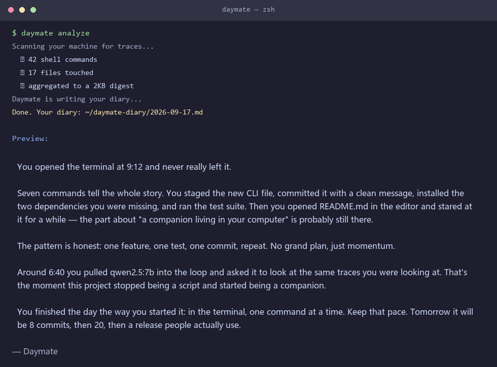

---
AIGC:
    Label: "1"
    ContentProducer: 001191440300708461136T1XGW3
    ProduceID: 7d6c7eb1722e648bcd4b478377c393f0_4a93aa56b38611f1a003525400cd780f
    ReservedCode1: zinbRHAbNpqBLgxzVwx6HZwhPeqYUnQVNLprgCmnYjHYTokk2tEfLSmE3VBt840ycbxeDs6AmHxTdOdbSq+11VOER3cL9PgTtn7R1mQreuTq040Nzeh+nB/PZdrikEUtnJOVg2F0wCYbcJLOHLovhRDHemQ5VHx2JinB5yAjgHLSOkB5NZuz9YvP1xM=
    ContentPropagator: 001191440300708461136T1XGW3
    PropagateID: 7d6c7eb1722e648bcd4b478377c393f0_4a93aa56b38611f1a003525400cd780f
    ReservedCode2: zinbRHAbNpqBLgxzVwx6HZwhPeqYUnQVNLprgCmnYjHYTokk2tEfLSmE3VBt840ycbxeDs6AmHxTdOdbSq+11VOER3cL9PgTtn7R1mQreuTq040Nzeh+nB/PZdrikEUtnJOVg2F0wCYbcJLOHLovhRDHemQ5VHx2JinB5yAjgHLSOkB5NZuz9YvP1xM=
---

# Daymate · 一天的伙伴

> 你电脑里住着一个陪你过完每一天的 AI 伙伴。
> 下班时运行一条命令，它会翻看你这一天的痕迹，写一篇只有你俩懂的文章。

```
$ daymate analyze
正在扫描本机痕迹...
正在请 Daymate 写作（37 条命令，12 次文件活动）...
今日日记已写好: ~/daymate-diary/2026-09-17.md
```

<p align="center">
  
</p>

## 它是什么

Daymate 读取你电脑上已有的数字痕迹——终端命令、最近修改的文件——在本地聚合成一小段摘要，再交给大模型，把"今天"写成一篇 300-500 字的短文。

不是工作日报，不是效率复盘。是一个住在你电脑里的朋友，认真看了你的一天。

## 为什么值得一试

- **零门槛体验**：`pip install daymate && daymate analyze`，不需要后台常驻、不需要配置环境
- **隐私优先**：所有痕迹只在你自己的电脑上处理；大模型只看到约 2KB 的聚合摘要，永远看不到原始日志
- **无 GPU 也能跑**：本机 Ollama 或免费云端 API 都行，`daymate setup` 三步选好后端
- **安装省心**：`daymate check` 自动体检，缺什么补什么

## 快速开始

```bash
# 1. 安装
pip install daymate

# 2. 配置后端（本地 Ollama 或云端 API，二选一）
daymate setup

# 3. 体检（自动检查缺什么）
daymate check

# 4. 生成今天的日记
daymate analyze
```

## 命令

| 命令 | 作用 |
|------|------|
| `daymate setup` | 交互式选择后端：本地 Ollama / OpenAI 兼容 API |
| `daymate check` | 环境体检：后端连接、模型安装、扫描目录 |
| `daymate analyze` | 分析已有痕迹，生成一天的日记（推荐先试这个） |
| `daymate start` | 实时陪伴模式：后台记录窗口与文件活动（开发中） |
| `daymate wrap` | 结束实时陪伴，生成日记（开发中） |

## 数据流

```
采集层（本地）         聚合层（本地）          生成层（本地/云端）
┌─────────────┐     ┌──────────────┐      ┌──────────────┐
│ 终端历史     │     │              │      │              │
│ 文件修改时间 ├───► │ 规则聚合      ├────► │ 大模型        │
│ 窗口标题*    │     │ 压缩成 ~2KB   │      │ 只消费摘要     │
└─────────────┘     └──────────────┘      └──────────────┘
```

原始日志**永不**进入大模型。聚合层用本地规则把一天压缩成结构化摘要（最常停留的窗口、最活跃的目录、最近的命令），LLM 只读这份摘要写作。

## 能力边界（如实说明）

- `analyze` 模式读取的是终端历史文件，**拿不到每条命令的具体时间**，也无法获知窗口停留时长；它会取最近一段命令作为"今天的痕迹"
- 拥有完整时间线的**实时模式（start/wrap）正在开发中**——那才是 Daymate 的完全体：每 30 秒记录一次前台窗口标题，能看出你一天的真实节奏（专注、分心、加班）
- 扫描范围严格限定在用户目录，自动跳过 `node_modules`、`.git`、缓存、系统目录

## 技术栈

Python 3.10+ · Typer · SQLite · Watchdog · Ollama / OpenAI 兼容 API

## 路线图

- [x] analyze 模式：扫描 → 聚合 → 生成
- [x] setup / check：后端配置与自动体检
- [ ] start 模式：窗口/文件实时采集（30s 轮询）
- [ ] wrap 模式：结束生成当日完整日记
- [ ] 周报 / 月度回顾生成
- [ ] 多端同步（可选）

## 关于作者

作者是一位 40 岁的媒体人，自学编程——没有科班背景，没有报过培训班，靠的是犟劲和一个个深夜。

如果你也觉得自己"太老了学不动"，这个项目就是反例。Daymate 能存在，恰恰因为有人决定在 40 岁开始学，而不是因为科班出身。

## License

MIT
*（内容由AI生成，仅供参考）*
